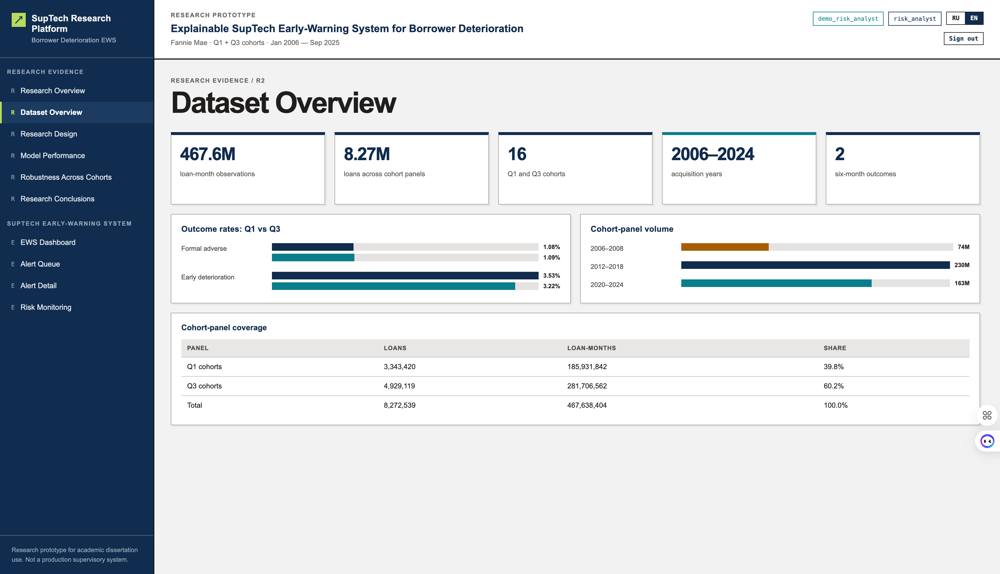
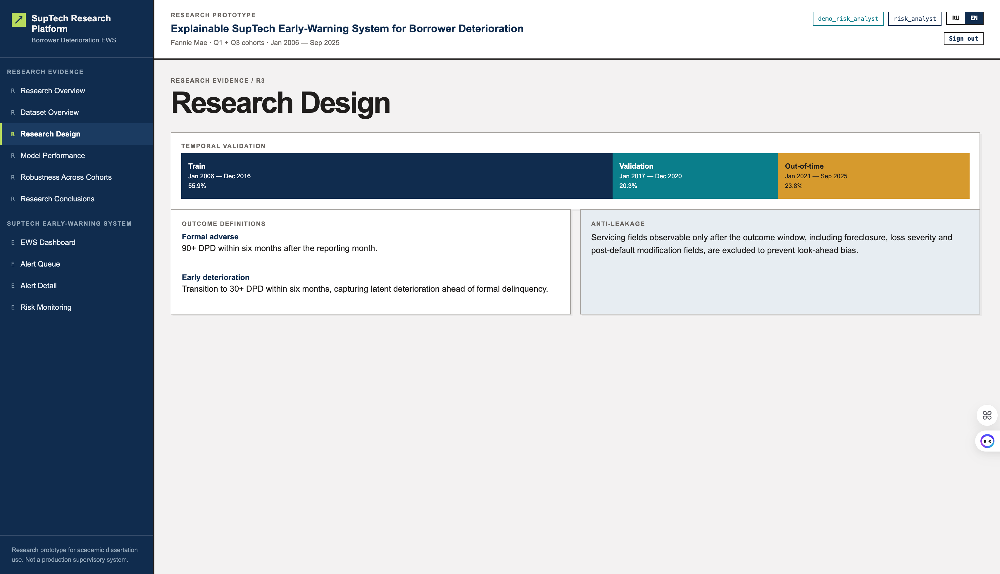
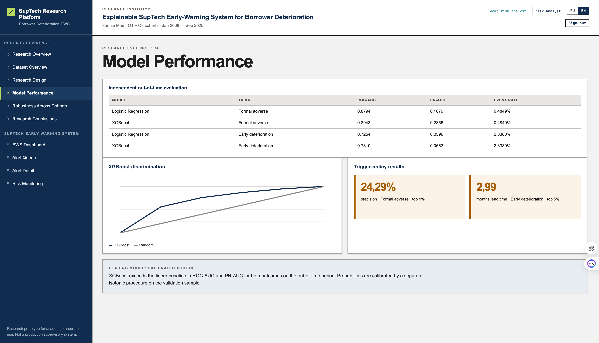
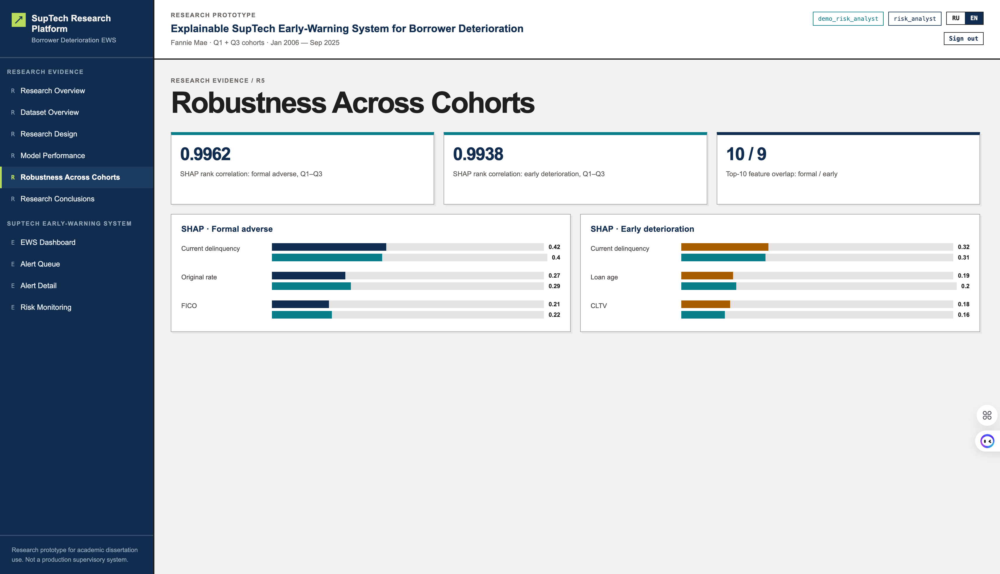
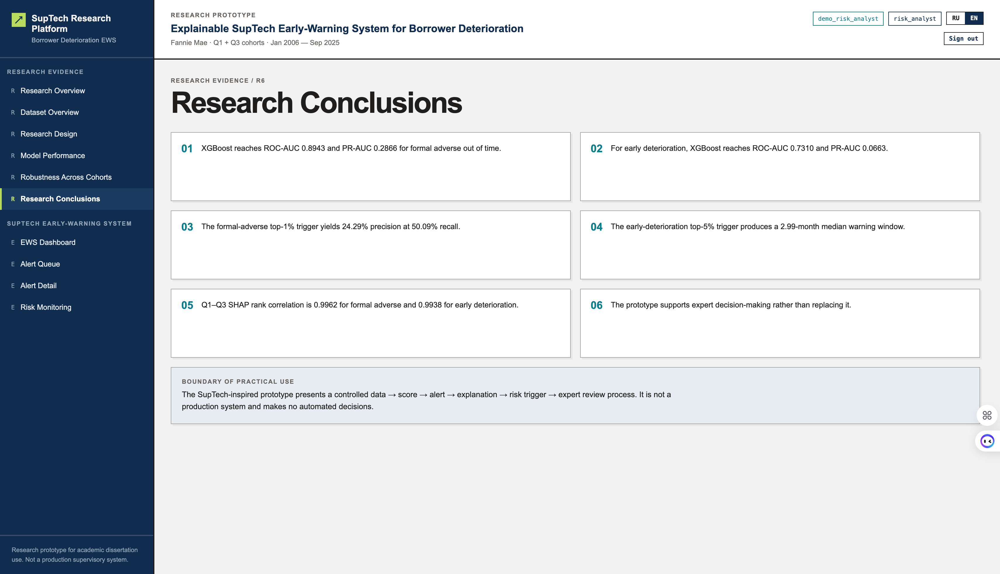

# Explainable SupTech Early-Warning Research Prototype

A research prototype for a dissertation on explainable artificial intelligence in credit risk. It presents Fannie Mae results as a controlled workflow:

`data → score → alert → explanation → risk trigger → expert review`

The prototype is not a production banking or supervisory system and does not make automated credit decisions.

## Quick Start

Docker Desktop is required. From the repository root, run:

```bash
docker compose up --build
```

After startup, open:

| Component         | Address                    | Purpose                                     |
| ----------------- | -------------------------- | ------------------------------------------- |
| Web interface     | http://localhost:5173      | Research dashboard and SupTech tool         |
| API documentation | http://localhost:8000/docs | FastAPI Swagger interface                   |
| PostgreSQL        | `localhost:5432`           | Local storage for users and the audit trail |

## Sign In

On the login page, select **RU / EN**, then enter a username and password. All demonstration accounts use the same password:

```text
demo-password-change-me
```

| Role                   | Username                | Access and Validation Scenario                                                                                                                                               |
| ---------------------- | ----------------------- | ---------------------------------------------------------------------------------------------------------------------------------------------------------------------------- |
| Research viewer        | `demo_research_viewer`  | View research results, the dashboard, alert queues, and alert details; creating expert reviews is not permitted.                                                             |
| Risk analyst           | `demo_risk_analyst`     | All viewer capabilities plus saving expert decisions for alerts to the audit trail.                                                                                          |
| Model governance       | `demo_model_governance` | Access to alerts, Model Governance, the registry, the audit trail, and creation and modification of local users.                                                             |
| Data steward           | `demo_data_steward`     | Access to alerts, Model Governance, the registry, and the audit trail; no user management permissions.                                                                       |
| Platform administrator | `demo_platform_admin`   | Access to research results and the administrative layer: creation of local users, role changes, and account deactivation. Access to alert data is intentionally not granted. |

To switch roles, click **“Sign out”** on the right side of the header and sign in using a different account.

## How to Use the Prototype

### 1. Research Evidence

The **“Research Evidence”** section includes:

* description of the Fannie Mae Q1 and Q3 cohorts;
* temporal validation design;
* model comparison and key metrics;
* cross-cohort robustness and SHAP results;
* research conclusions.

### 2. Early-Warning System

In the **“Early-Warning System”** section:

1. Open **“Alert Queue”** and filter Red/Amber alerts or review status.
2. Select an alert, then open **“Alert Details”**.
3. Review the risk score, trigger threshold, model version, data version, and local SHAP explanation.
4. Under the `risk_analyst` or `model_governance` role, save the expert decision:
   **Priority follow-up**, **Watchlist**, **Monitoring**, or **No immediate action**.
5. Under the `model_governance` or `data_steward` role, verify that the event appears in **Model Governance → Audit trail**.

### 3. Administration

The **Administration** section is available to `model_governance` and `platform_admin`.

It allows users to create a local user account, assign or change a role, deactivate an account, and provide a reason for the change.

Workflow safeguards:

* users cannot change their own role or active status;
* access changes require a reason and confirmation;
* the last active `platform_admin` cannot be demoted or deactivated;
* a deactivated account cannot sign in again;
* `user_created` and `user_access_updated` events are stored in `audit_events`.

## Data and Security

By default, the API uses synthetic demonstration alerts. The browser interface receives only a safe alert DTO containing the score, tier, cohort, observation date, SHAP explanatory factor, and model/data versions.

The browser **never receives** raw Fannie Mae files, persistent loan IDs, complete feature vectors, or training datasets. A real research data mart may only be connected through a pre-approved CSV export and a server-side adapter. See the [data contract](docs/suptech/09_data_contract_and_access_policy.md) and [architecture documentation](docs/suptech/README.md) for details.

## Development Verification

```bash
npm run test:ui

python3 -m unittest tests.api.test_live_api tests.api.test_score_export_adapter

npm run build
```

## Repository Structure

```text
src/
├── common/               # shared provider-neutral components
├── fannie_mae/           # Fannie Mae research pipeline
├── freddie_mac/          # Freddie Mac ingestion and preparation
└── prototype/            # React UI, FastAPI, PostgreSQL audit trail

fannie_mae/               # Fannie Mae data, models, reports, and documentation
freddie_mac/              # Freddie Mac data, reports, and documentation
docs/assets/screenshots/  # versioned screenshots used by project documentation
tests/                    # API and frontend policy tests
```

The two providers are not combined into a single training table: the active model uses Fannie Mae, while Freddie Mac is retained as an independent data source for future transferability validation.

## Interface screenshots

The screenshots below were captured from the local development prototype. Alert
records are synthetic demonstrations; no raw Fannie Mae records are displayed.

### Access and research evidence


*Figure 1. Local sign-in screen with RU/EN language selection.*


*Figure 2. Research overview: research gap, objective, contribution and the controlled review workflow.*



*Figure 3. Dataset overview: cohort coverage, volume and outcome-rate comparison for Q1 and Q3.*



*Figure 4. Research design: temporal splits, outcome definitions and anti-leakage controls.*



*Figure 5. Independent out-of-time model evaluation and trigger-policy results.*



*Figure 6. Cross-cohort robustness: SHAP rank correlations and leading explanatory factors.*



*Figure 7. Research conclusions and the boundary of practical use of the prototype.*

### Early-warning workflow


*Figure 8. Alert queue with tier, review-status and alert-ID filters.*


*Figure 9. Alert-detail view with risk score, trigger threshold, local SHAP explanation and expert-review form.*


*Figure 10. Risk-monitoring view: alert volumes, Red/Amber distribution and human-in-the-loop boundary.*
