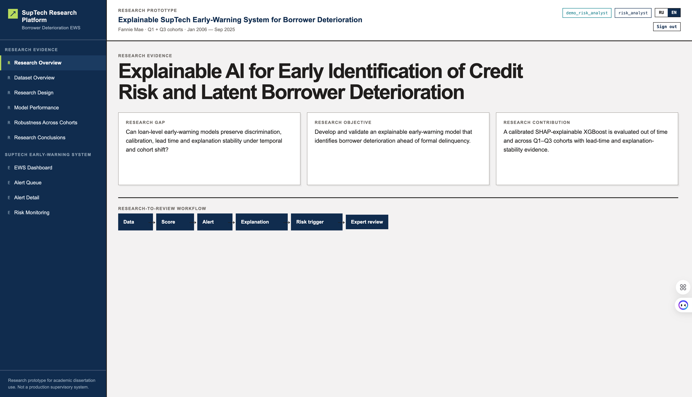
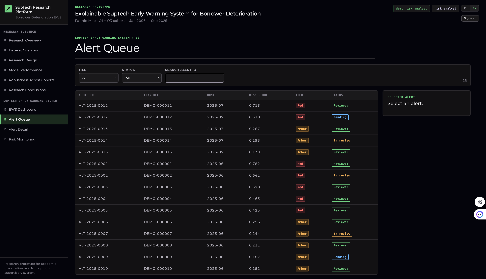
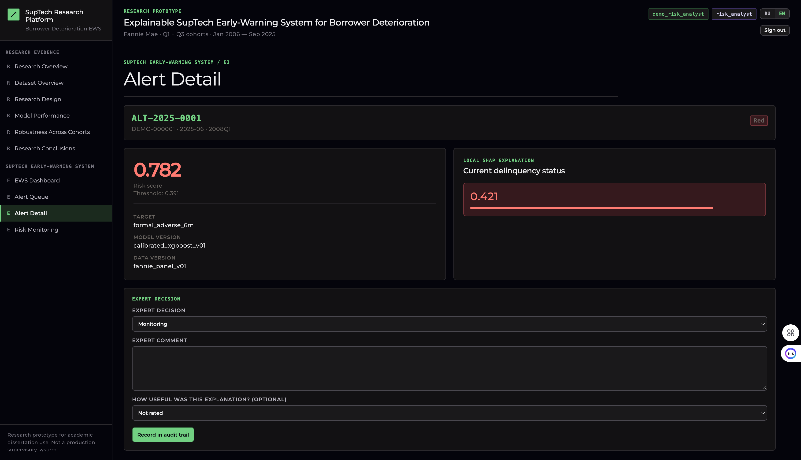
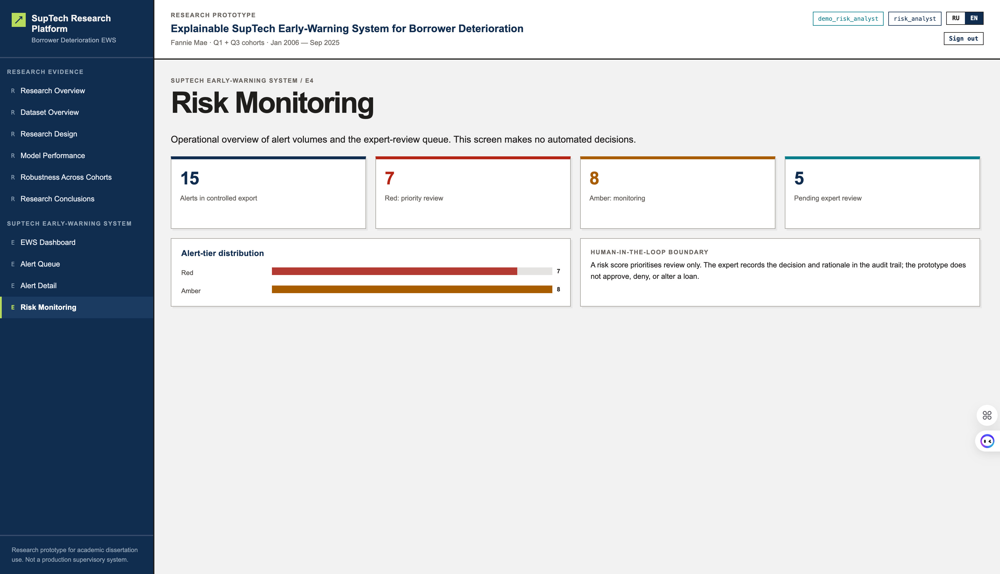

<div align="center">

# Объяснимая SupTech-система раннего предупреждения

### Исследовательский прототип раннего выявления ухудшения состояния заёмщика

<p><a href="README.md">English</a> · <a href="README_ru.md"><strong>Русский</strong></a></p>

<p>
  
  
  
</p>

<p>
  <a href="#быстрый-запуск">Быстрый запуск</a> ·
  <a href="#научные-результаты">Результаты</a> ·
  <a href="#suptech-процесс">Процесс</a> ·
  <a href="#роли-и-доступ">Роли</a> ·
  <a href="#границы-безопасности">Безопасность</a> ·
  <a href="#структура-репозитория">Структура</a>
</p>

</div>

> **Граница исследования.** Проект является исследовательским прототипом для
> диссертации. Он приоритизирует случаи для проверки человеком и не принимает
> автоматические кредитные, надзорные или правоприменительные решения.

```text
данные → оценка риска → сигнал → объяснение → risk trigger → экспертная проверка
```

Проект реализует объяснимое раннее предупреждение на уровне «кредит–месяц»:
временную валидацию, контроль утечки информации, калибровку вероятностей,
capacity-based Red/Amber alerts, локальные SHAP-объяснения и аудитируемый
workflow экспертной проверки.

<p align="center">
  
  
</p>

## Что включено

| Контур | Содержание репозитория |
|---|---|
| Работа с данными | Fannie Mae ingestion, проверки качества, когортные панели, исходы, leakage register, manifests и reports |
| Модели | Logistic Regression и XGBoost baseline; горизонты, объём train, Q1/Q3, calibration и explainability |
| Научные артефакты | EDA, temporal validation, метрики, trigger policy, SHAP, permutation importance, ALE, рисунки и главы на двух языках |
| SupTech-прототип | React, FastAPI, PostgreSQL audit trail, RBAC, администрирование и Docker Compose |
| Граница переносимости | Freddie Mac остаётся отдельным контуром будущей external validation |

## Быстрый запуск

### Запустите полный прототип

Установите [Docker Desktop](https://www.docker.com/products/docker-desktop/),
затем выполните из корня репозитория:

```bash
docker compose up --build
```

| Сервис | Адрес | Назначение |
|---|---|---|
| Web-приложение | <http://localhost:5173> | Научные результаты и SupTech workflow |
| API-документация | <http://localhost:8000/docs> | OpenAPI / Swagger FastAPI |
| PostgreSQL | `localhost:5432` | Локальные пользователи, reviews и audit events |

```bash
docker compose down
```

### Войдите в систему

На странице входа доступен выбор **RU / EN**. Для всех демонстрационных
учётных записей используется пароль:

```text
demo-password-change-me
```

| Роль | Демонстрационный логин | Основная возможность |
|---|---|---|
| Research viewer | `demo_research_viewer` | Просмотр научных результатов, сигналов и объяснений |
| Risk analyst | `demo_risk_analyst` | Проверка сигналов и сохранение решения эксперта |
| Model governance | `demo_model_governance` | Сигналы, registry/audit trail и управление пользователями |
| Data steward | `demo_data_steward` | Сигналы, registry и audit trail; без управления пользователями |
| Platform administrator | `demo_platform_admin` | Управление пользователями и научные разделы; alert-данные закрыты |

Для проверки другой роли используйте **«Выйти / Sign out»** в шапке.

## Научные результаты

Основные модели v01 используют Q1-когорты Fannie Mae, временное разделение и
шестимесячный горизонт. Для этого базового контура OOT не применялся для
обучения, калибровки, выбора порога или гиперпараметров.

| Исход | Ведущая модель | OOT ROC-AUC | OOT PR-AUC | Операционная policy |
|---|---|---:|---:|---|
| `formal_adverse_6m` | XGBoost | **0,8943** | **0,2866** | Red: top 1%; precision 24,29%; recall 50,09% |
| `early_deterioration_6m` | XGBoost | **0,7310** | **0,0663** | Amber: top 5%; precision 8,69%; recall 18,59% |

<details>
<summary><strong>Открыть реестр исследовательских экспериментов</strong></summary>
<br>

- сравнение горизонтов 3, 6 и 12 месяцев;
- чувствительность к объёму natural-rate train: 1%, 5%, 10% и 25%;
- сопоставление Q1/Q3 и устойчивость объяснений;
- диагностики SHAP, permutation importance и ALE;
- Logistic Regression, XGBoost, CatBoost, LightGBM и заранее определённые
  hybrid experiments в Q1+Q3-контуре;
- завершённый v02 governance-эксперимент для tree-моделей Q1+Q3: 18 обучений
  на validation, калибровка только на validation и однократная OOT-проверка.
  Реестровая модель не изменена; см. [итоговую таблицу governance-решения](fannie_mae/reports/tree_hyperparameter_selection_v01/tree_oot_governance_decision_v01.csv).

Детальные артефакты: [`fannie_mae/reports/`](fannie_mae/reports/) ·
[`fannie_mae/docs/`](fannie_mae/docs/).

</details>

## SupTech-процесс

```text
Исследовательские данные Fannie Mae
        │
        ▼
допустимые на дату t признаки ──► калиброванный model score
                                        │
                                        ▼
                              Red / Amber queue policy
                                        │
                                        ▼
                         локальное SHAP-объяснение + metadata
                                        │
                                        ▼
                    экспертная проверка + audit event + observed outcome
```

1. Откройте **«Очередь сигналов / Alert Queue»** и отфильтруйте Red/Amber или статус review.
2. В **«Карточке сигнала / Alert Details»** проверьте score, threshold, версии данных/модели и локальное SHAP-объяснение.
3. Под `risk_analyst` или `model_governance` сохраните решение эксперта.
4. Под `model_governance` или `data_steward` откройте **Model Governance → Audit trail**.

<p align="center">
  
  
</p>

## Роли и доступ

| Действие | Viewer | Analyst | Governance | Steward | Admin |
|---|:---:|:---:|:---:|:---:|:---:|
| Просмотр научных результатов | ✓ | ✓ | ✓ | ✓ | ✓ |
| Просмотр сигналов и объяснений | ✓ | ✓ | ✓ | ✓ | — |
| Сохранение expert review | — | ✓ | ✓ | — | — |
| Registry и audit trail | — | — | ✓ | ✓ | — |
| Создание, смена роли, деактивация | — | — | ✓ | — | ✓ |

Ограничения: пользователь не меняет собственную роль и активность; изменение
доступа требует подтверждения и причины; последнего активного
`platform_admin` нельзя понизить или деактивировать.

## Границы безопасности

| Защищаемый элемент | Правило |
|---|---|
| Raw Fannie Mae файлы | Никогда не передаются в браузер |
| Loan IDs и полные feature vectors | Не выдаются через alert API |
| Контракт браузера | Только safe alert DTO: pseudonymous reference, score, tier, версии, объяснение, review state и допустимый observed outcome |
| Подключение исследовательских данных | Только server-side adapter к предварительно разрешённому safe score-export |
| Автоматическое действие | Явно запрещено; система только приоритизирует human review |
| Макроконтекст | Point-in-time pipeline подготовлен как future work и не включён в frozen models v01/v02 |

## Проверка разработки

```bash
npm run test:ui
python3 -m unittest tests.api.test_live_api tests.api.test_score_export_adapter
npm run build
```

## Структура репозитория

```text
src/
├── common/               # provider-neutral utilities
├── fannie_mae/           # Fannie Mae research pipeline и reproducibility scripts
├── freddie_mac/          # Freddie Mac ingestion и preparation
└── prototype/            # React UI, FastAPI API, PostgreSQL audit trail

fannie_mae/               # config, provider-restricted data, models, reports, документация
freddie_mac/              # изолированный контур будущей external validation
docs/assets/screenshots/  # versioned screenshots прототипа
tests/                    # API и UI policy tests
```

## Индекс документации

| Документ | Содержание |
|---|---|
| [Главы на русском](fannie_mae/docs/docs_ru/chapters/) | Академический текст, приложения, выводы и материалы к защите |
| [Главы на английском](fannie_mae/docs/docs_en/chapters/) | Англоязычная версия глав и методологических приложений |
| [Методологический аудит](fannie_mae/docs/docs_ru/appendices/appendix_a_methodological_audit.md) | Данные, очистка, leakage, исходы, splits, модели, calibration и triggers |
| [Data lineage и глоссарий](fannie_mae/docs/docs_ru/appendices/appendix_b_data_lineage_and_glossary.md) | Слои исследования, safe export и терминология |
| [Итоговый аудит артефактов](fannie_mae/reports/dissertation_finalization_v01/reference_audit_v01.md) | Проверка нумерации и ссылок на локальные артефакты |

---

<div align="center"><strong>Explainable AI for credit-risk early warning</strong><br>Контролируемый исследовательский workflow для прозрачной экспертной проверки.</div>
